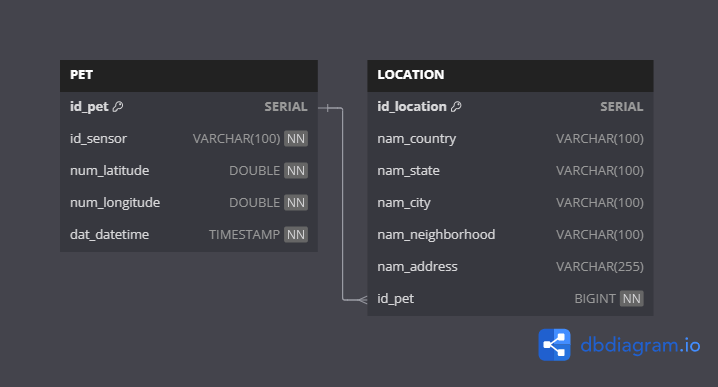

# 🎲 Banco de dados

## 🛠️ Tecnologias

| Tecnologia                                                                                                                                    | Por que foi escolhida?                                                                                                                                     |
|:----------------------------------------------------------------------------------------------------------------------------------------------|:-----------------------------------------------------------------------------------------------------------------------------------------------------------| 
|                                                                  | Nessa aplicação utilizamos o **PostgreSQL** que devido ao seu caráter de **SQL** permitiu um fácil relacionamento entre as tabelas **PET** e **LOCATION**. |
|  | Nessa aplicação utilizamos o **FlyWay** para versionar as migrations e assim manter o controle de versão do banco de dados.                                |

## 📊 Tabelas
Nessa aplicação possuímos duas tabelas, sendo elas:
- **PET:** Responsável por armazenar as coordenadas, id de sensor, data e hora relativas ao pet.
- **LOCATION:** Responsável por armazenar a localização do pet com base nas coordenadas informadas

Essas tabelas possuem um relacionamento **OneToMany**, onde um pet pode ter várias localizações. 
Esse relacionamento foi estabelecido para que fosse possível construir um histórico de localizações por onde o pet esteve 
e através do relacionamento entre elas é possível recuperar também a mais recente.

---

## 📑 Diagrama de relacionamento

---

## ⚠️️ Atenção
Devido ao fluxo de negócio contemplado pela aplicação, não há remoção de dados da tabela **LOCATION** por isso a longo prazo a possibilidade de expurgos periódicos deve ser debatida. 

